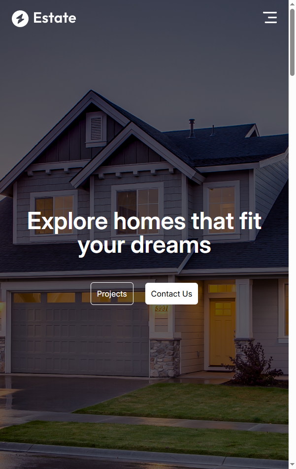
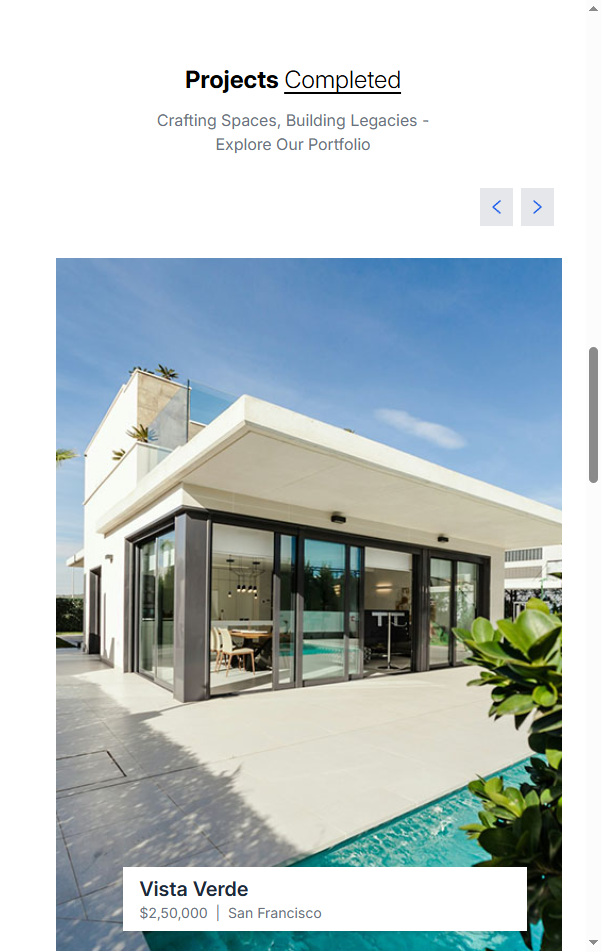
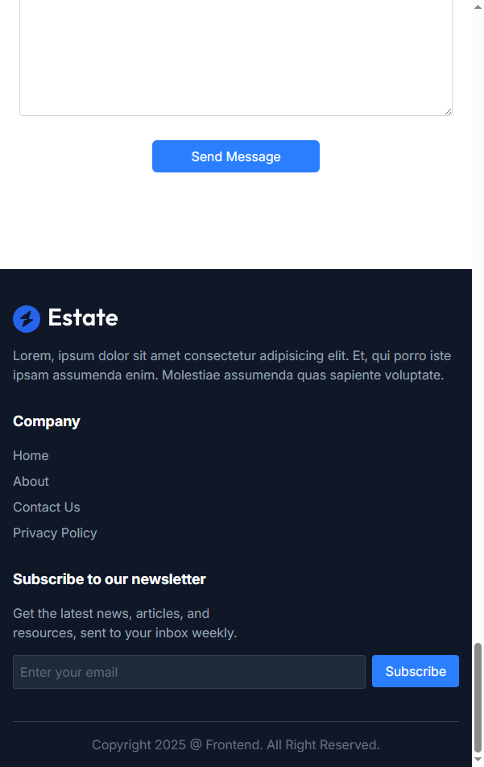

# Real Estate - Landing Page

A responsive frontend project developed on React.js.

Tools:
- React
- HTML
- Tailwind CSS
- Javascript
- Framer Motion for Animations

Link: https://real-state-frontend.netlify.app/

## Screenshots:

### Web:
      

   

### Mobile:
 &ensp; &ensp;&ensp;  &ensp; &ensp;&ensp; 
